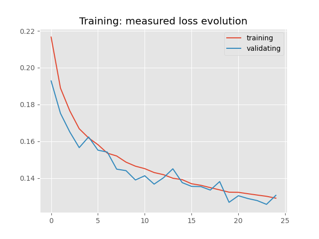
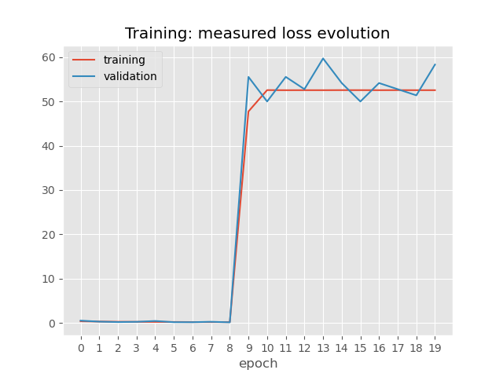
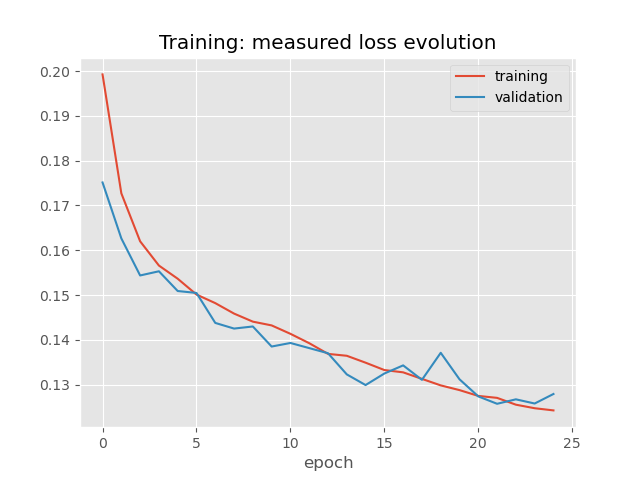
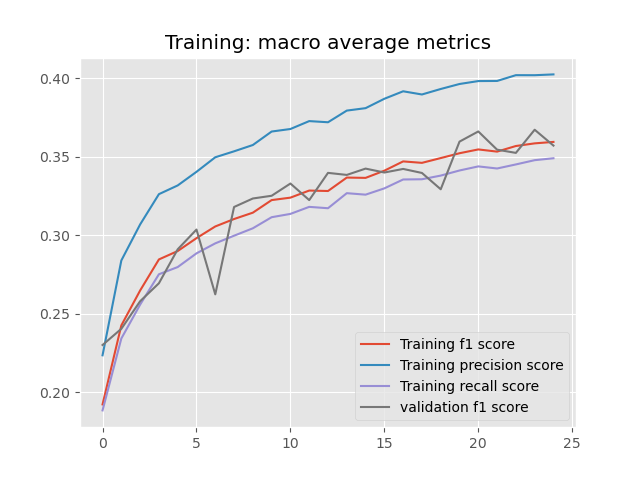
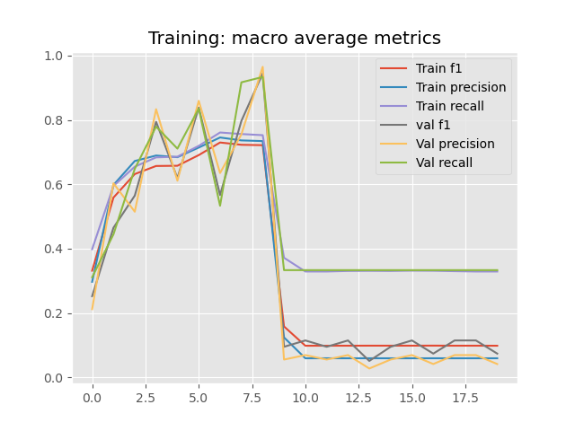
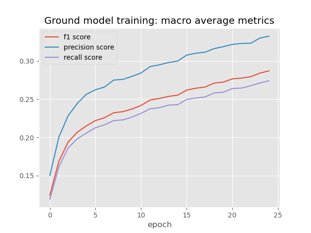
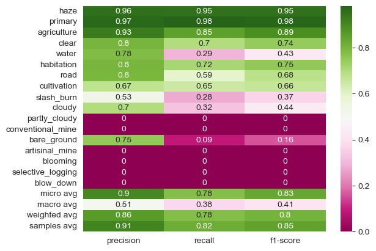
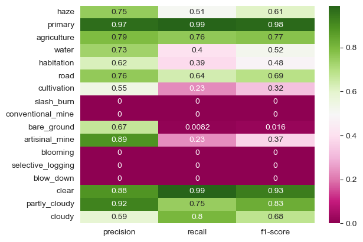
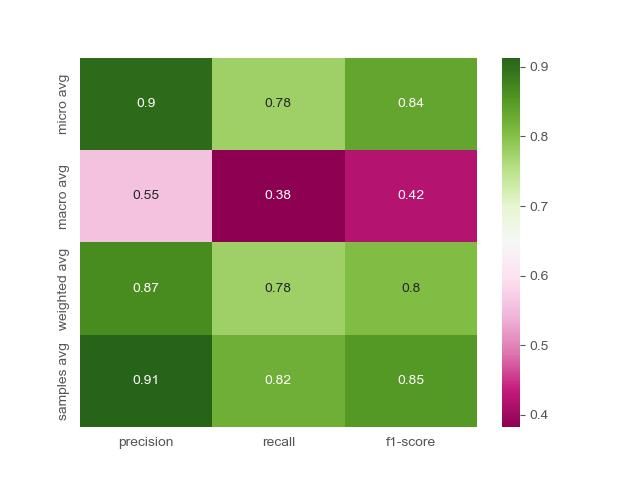
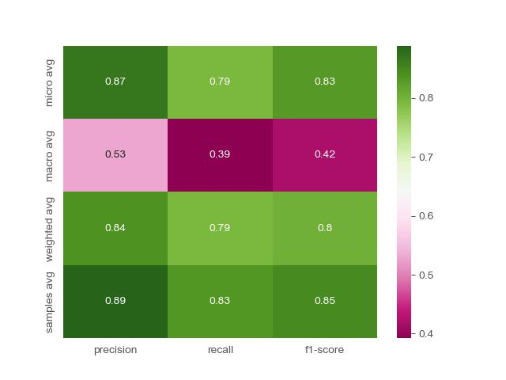

 A deep learning project by Geza Soldati, Shadya Gamal and Anna Halloy
# Planet: Understanding the Amazon from Space

## Topic
This project is focused on the set of 40479 images of the Amazon basin. 
They come from Planet’s Flock 2 satellites and were collected between January 1, 2016 and February 1, 2017. 
Each image has a size of 256x256 pixels and is defined only by the RGB band. 
Each image is associated with a set of labels describing it.
There are in total 17 possible labels that characterise the ground and atmospheric conditions.

## Goals
The main goal of this project is to create a model that can predict which label is associated to an image.

The additional goal is to compare the performance of two approaches: 
- The first approach, here often referred as "multilabel model", is the training of a CNN model with, as output, 
a binary array of size 17, corresponding to the prediction for each label. 
- The second approach, here often referred as "multi-model", is the training of two CNN models where one is a
multiclass classifier related to the 3 atmospheric condition labels (cloud cover), and the second is a multilabel
classifier related to the 14 other ground condition labels.

## Repository structure
```
.
├── src/                                  # Reusable model/dataset classes ("Module") and training/eval logic ("Engine")
│   ├── Multilabel_Amazon_Module.py
│   ├── Multilabel_Amazon_Engine.py
│   ├── MultiModel_Amazon_Module.py
│   └── MultiModel_Amazon_Engine.py
├── data/                                 # Train/validation/test splits (see IPEO_data_Pre_Processing.ipynb)
│   ├── training.csv
│   ├── validation.csv
│   └── test.csv
├── outputs/
│   ├── Final_Models/                     # Final trained weights and metrics (json) for all 3 models
│   ├── Figures/                          # Training curves and evaluation heatmaps
│   ├── param_fitting/                    # Hyperparameter search results (batch size, lr, momentum, transforms)
│   ├── class_weight.pt                   # Class weights for the (optional) weighted multilabel loss
│   └── class_weight_norm.pt
├── IPEO_data_Pre_Processing.ipynb        # Data exploration and train/val/test split generation
├── Multilabel_classification_Amazon.ipynb  # Train/test the single multilabel model
├── MultiModel_classification_Amazon.ipynb  # Train/test the cloud (multiclass) + ground (multilabel) models
├── IPEO_Post_Processing.ipynb            # Hyperparameter comparison and final results analysis
└── requirements.txt
```

Each of the two approaches is built from a notebook plus two associated Python files: "Module" groups the dataset
and model classes, and "Engine" groups the training/evaluation functions used by that notebook.

`IPEO_data_Pre_Processing.ipynb` is the file associated to the pre-processing we implemented before
training and testing. It is not needed to be re-run to be able to train or test our models — running it produces
the 3 csv files in `data/`, which are already provided.

The main files, `Multilabel_classification_Amazon.ipynb` and `MultiModel_classification_Amazon.ipynb`,
are the files to run to train, validate and test the models.

`IPEO_Post_Processing.ipynb` is an additional file regrouping the hyperparameter comparisons and figures used
in the project report, reading from `outputs/param_fitting/`.

## Results
### Training
Final models are saved in `outputs/Final_Models/`, together with their training results (json). Training loss
and validation metrics (precision, recall, F1) evolved as follows:

| Multilabel model | Cloud model | Ground model |
|---|---|---|
|  |  |  |
|  |  |  |

All three models train smoothly, with training and validation losses staying close together (little overfitting).
For the cloud model in particular, one training run (lr 0.005, momentum 0.5) reached over 90% precision, recall
and F1 on the "clear", "partly_cloudy" and "cloudy" labels before its loss curve degraded at later epochs — the
weights checkpointed from that run are the ones kept as `CloudModel_Final.pth`.

### Evaluation
Test-set performance is reported per label (precision/recall/F1) and as global averages (micro, macro, weighted
and samples averages), for both the single multilabel model and the combined cloud + ground approach:

| Multilabel model — per-label & averages | Combined model — per-label |
|---|---|
|  |  |

Global averages for both approaches, side by side for direct comparison:

| Multilabel model — averages | Combined model — averages |
|---|---|
|  |  |

Precision is generally higher than recall for both approaches, meaning true labels are more often missed than
falsely predicted. Rarely-represented labels (`slash_burn`, `conventional_mine`, `blooming`, `selective_logging`,
`blow_down`) score near zero in both approaches, dragging the macro average well below the micro/weighted/samples
averages, which are dominated by common labels. The combined approach clearly improves the atmospheric labels —
notably `partly_cloudy`, which the single model never predicts at all — and improves `water` recall (0.29 → 0.40),
at the cost of most ground labels scoring slightly lower than in the single multilabel model. Overall F1 is very
close between the two approaches (~0.83–0.85 samples average), so neither is a clear winner on aggregate.

## Dependencies
Install the required Python packages with:
```
pip install -r requirements.txt
```

## Instructions to run
The main files are all Jupyter notebooks in Python. 

The order in which to run the notebooks is the following: 
1) `IPEO_data_Pre_Processing.ipynb` (Optional) (To explore and split the data)
2) `Multilabel_classification_Amazon.ipynb` (To train and test the first model)
3) `MultiModel_classification_Amazon.ipynb` (To train and test the second model)
4) `IPEO_Post_Processing.ipynb` (Optional) (To plot and compare the results)
